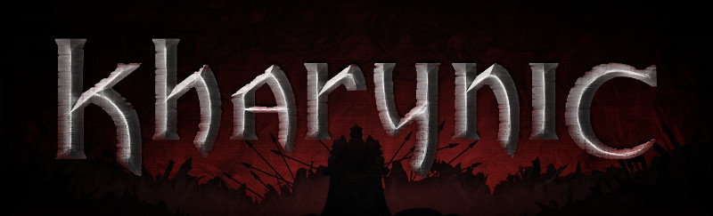
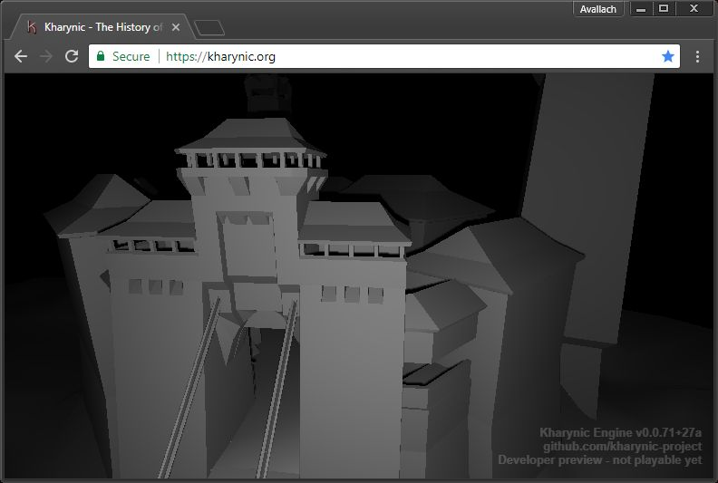

# Kharynic: The History of Mine Valley

Classic 3D cRPG in dark low fantasy setting. Brutal, grim world *almost* devoid of magic.
This is work in progress. Game is not playable yet.

# Platform: web
Playing directly on [kharynic.org](https://kharynic.org), without installation nor registration. Game made with WebGL and WebAssembly, packaged as Web App. Both engine build, assets and gameplay scripts streamed from GitHub repository over CloudFlare. Available offline access (and desktop / application menu shortcuts).

# Open web development
Editing gameplay scripts, story dialogues, adding new assets - all possible from within browser. Local build system or CI server needed only for engine development. All public GitHub forks accessible from [kharynic.org/dev/?{user}](https://kharynic.org/dev/?avallach7).

# Grim and mature story
Story takes place in remote fortress in the mountains. Once it served as high security prison for violent insane criminals and traitors of the crown. Cells are getting more and more crowded, as king-tyrant sends here everyone suspected of opposing his iron hand rules and bloody conquests. Prisoners are forced to work building new, large ring of fortifications around the fortress and large wooden baracks with prison cells inside. Over time they are joined by captured deserters and even people unable to pay rising taxes. Rumors say that king is going to use them to revive old mines in the area, as he needs swords and armor for crowds of conscripts. 

# Status

Project is in very early stage. There is a preview build available on the website with free camera and basic location mesh, that can be linked to desktop and run in separate window on platforms with Web App standard.
Currently scripting (C# - JS interop) and game editing system (script and map editor) is being developed. Efforts are focused on making further development easier for people with no expierience in software development. Roadmap can be found in [docs/roadmap.md](docs/roadmap.md).
